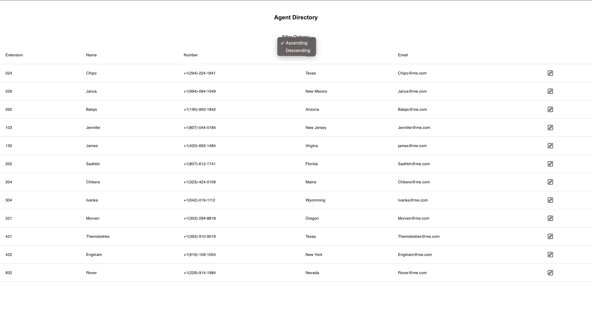

Here we have a product feature that allow users to easily oversee all agents within the company. This is the first iteration into giving our staff memebers the ability to transfer agents directly to outside agents with just a click of a button. As you can see we are having some errors with loading in the list of users as well as actually sorting them. 

Please reference the image attatched below and use this to get a better understanding of what we're kind of looking for in terms of first iteration. Also note this code will fall into the hands of many other engineers so please make it easy to read and follow.

In terms of adding functionality not shown within the screenshot and UI design, please feel free to add what you would like in the allotted time, but do not make it your primary focus. Clean functional code is our main focus here at eXp.

If you have any questions or concerns feel free to contact Colton Gibson at colton.gibson@exprealty.net or Tyler Bakken @ tyler.bakken@exprealty.net and we will do our best to answer any questions you have as efficiently as we can!